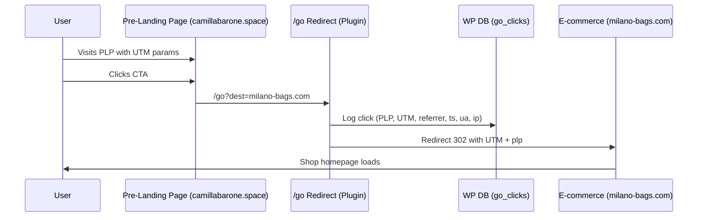
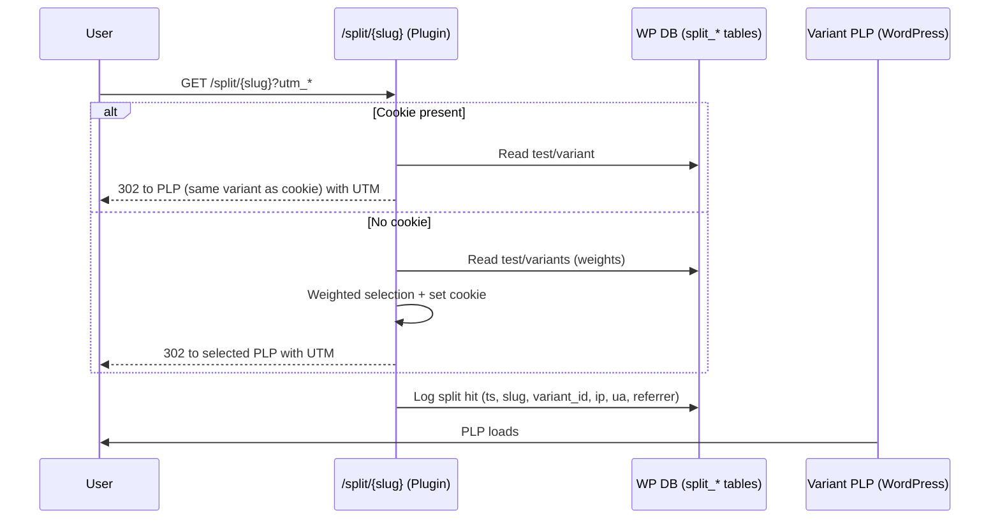

# GoWPTracker – Architecture Overview

## 🎯 Goal
The purpose of **GoWPTracker** is to provide **server-side tracking** of outbound clicks from pre-landing pages (PLPs) to an external e-commerce site.  
It allows marketers to identify **which PLPs generate the most traffic** toward the shop and to analyze performance across campaigns (via UTM parameters).

---

## 🧩 High-Level Architecture
The system introduces a controlled **redirect endpoint** (`/go`) inside WordPress.  
This endpoint acts as a **gatekeeper**: it logs click metadata before redirecting the user to the target e-commerce URL.

### Flow
1. **Traffic Entry**
   - Users arrive on a PLP (e.g., `camillabarone.space/migliori-borse`) with UTM parameters from ads.
2. **CTA Click**
   - CTA buttons point to `/go?dest=https://milano-bags.com/...`.
   - A JavaScript helper ensures UTM parameters and PLP slug are appended automatically.
3. **Redirect Handling**
   - The `/go` route validates the destination domain (whitelist).  
   - Logs are written into a dedicated database table.  
   - User is redirected (HTTP 302) to the e-commerce site with all UTM and PLP parameters preserved.
4. **Reporting**
   - WordPress admin panel shows aggregated metrics (clicks per PLP, breakdown by campaign, time filters).

---

## 🗄️ Data Model
Custom DB table: `wp_go_clicks`

| Column       | Type             | Notes                                  |
|--------------|------------------|----------------------------------------|
| id           | BIGINT AUTO_INC  | Primary key                            |
| ts           | DATETIME         | Timestamp of the click                  |
| ip           | VARBINARY(16)    | Visitor IP in binary (IPv4/IPv6)        |
| ua           | TEXT             | User agent                             |
| referrer     | TEXT             | Page referrer                          |
| dest         | TEXT             | Destination URL                        |
| dest_host    | VARCHAR(191)     | Destination host (for validation)       |
| plp          | VARCHAR(191)     | Pre-landing page slug                   |
| utm_source   | VARCHAR(191)     | UTM param                              |
| utm_medium   | VARCHAR(191)     | UTM param                              |
| utm_campaign | VARCHAR(191)     | UTM param                              |
| utm_content  | VARCHAR(191)     | UTM param                              |
| utm_term     | VARCHAR(191)     | UTM param                              |
| fbclid       | VARCHAR(191)     | Facebook click ID                      |
| gclid        | VARCHAR(191)     | Google Ads click ID                    |

Indexes:
- `idx_ts` (query by time range)
- `idx_plp` (query by PLP slug)
- `idx_dest_host` (filter by domain)

---

## 🔒 Security Considerations
- **Domain whitelist**: prevents open redirects. Only configured shop domains are allowed.  
- **Input sanitization**: all query parameters sanitized before logging or propagation.  
- **IP handling**: stored in binary (not plain text) for privacy compliance.  
- **Redirect type**: 302 (temporary) ensures no SEO impact.  

---

## 📊 Reporting Layer
The plugin includes an admin page:
- **Aggregations**: clicks grouped by PLP and campaign.  
- **Filters**: time range selector (e.g., last 7 days, last 30 days).  
- **Output**: table view, optional CSV export (future extension).  

This allows non-technical users to quickly identify the best-performing PLPs.

---

## ⚙️ Extensibility
The system is designed to be modular:
- **Destination validation**: customizable via plugin settings.  
- **Logging**: can be extended to push data into external BI tools (BigQuery, Redshift, etc.).  
- **Webhooks**: future support for sending events to analytics or CRM in real-time.  
- **Conversion tracking**: can be paired with shop-side events to build funnels (click → session → purchase).

---

## 🔧 Deployment & Maintenance
- Install plugin in `wp-content/plugins/go-tracker/`.  
- Activate from WP Admin.  
- Configure allowed domains.  
- Update CTA links in PLPs to point to `/go`.  
- Optional: add JavaScript helper to automatically append UTM and PLP slug.  

---

## 🖼️ Sequence Diagram

---

# Split Testing – Architecture Addendum

## 🧩 High-Level Overview
The Split Testing feature introduces a public endpoint `^split/{slug}` that routes users to one of multiple WordPress pages (variants) with weighted rotation and sticky assignment via cookie. UTM and query params are propagated to the destination PLP.

### Components
- Endpoint: `/split/{slug}` (rewrite + query var + handler in `template_redirect`).
- Admin UI: manage tests (create/edit, dynamic variants up to 10, percent weights, equalize button).
- DB: split tests, variants, and hit logs.
- Reporting: clicks by test/variant with CSV export.

## 🗄️ Data Model (Split)
Additional tables:

- `{prefix}go_split_tests`
  - `id BIGINT UNSIGNED PK AUTO_INCREMENT`
  - `slug VARCHAR(191) UNIQUE NOT NULL`
  - `name VARCHAR(191) NOT NULL`
  - `status TINYINT(1) NOT NULL DEFAULT 1`
  - `created_at DATETIME NOT NULL`
  - `updated_at DATETIME NOT NULL`

- `{prefix}go_split_variants`
  - `id BIGINT UNSIGNED PK AUTO_INCREMENT`
  - `test_id BIGINT UNSIGNED NOT NULL` (FK)
  - `post_id BIGINT UNSIGNED NOT NULL`
  - `weight INT UNSIGNED NOT NULL` (percent-based in UI)
  - `created_at DATETIME NOT NULL`
  - `updated_at DATETIME NOT NULL`
  - Indexes: `KEY idx_test (test_id)`, `KEY idx_post (post_id)`

- `{prefix}go_split_hits`
  - `id BIGINT UNSIGNED PK AUTO_INCREMENT`
  - `ts DATETIME NOT NULL`
  - `test_slug VARCHAR(191) NOT NULL`
  - `variant_id BIGINT UNSIGNED NOT NULL`
  - `client_id VARCHAR(191) NULL` (cookie-based id)
  - `ip VARBINARY(16) NOT NULL`
  - `ua TEXT NULL`, `referrer TEXT NULL`
  - Indexes: `KEY idx_ts (ts)`, `KEY idx_test (test_slug)`, `KEY idx_variant (variant_id)`

## 🔀 Flow (/split)
1. Read `slug` from query var; fetch active test and variants.
2. If cookie `GoWPTrackerSplit_{slug}` is present and valid → use stored variant (sticky, 30 days).
3. Else perform weighted selection based on variant `weight`.
4. Build destination as the permalink of `post_id`; merge query/UTM from `/split`.
5. Log hit into `{prefix}go_split_hits`; issue 302 redirect.

Cookie:
- Name: `GoWPTrackerSplit_{slug}`
- Value: `variant_id` (optionally combined with `client_id`)
- Expiry: 30 days; Path: `/`

## 🔒 Security Notes (Split vs Go)
- `/go`: blocks HEAD/bots to keep click logs clean; enforces destination whitelist.
- `/split`: does NOT block HEAD/bots (compatibility with crawlers and ad review).
- Inputs sanitized; outputs escaped; capabilities checked in Admin; nonce on forms.
- Redirects only to valid WP permalinks (no open redirect).

## 📊 Reporting (Split)
- Admin screen: select test and time range (7/30 days) → clicks per variant.
- CSV export aligned with on-screen dataset.

## 🖼️ Sequence Diagram – Split

