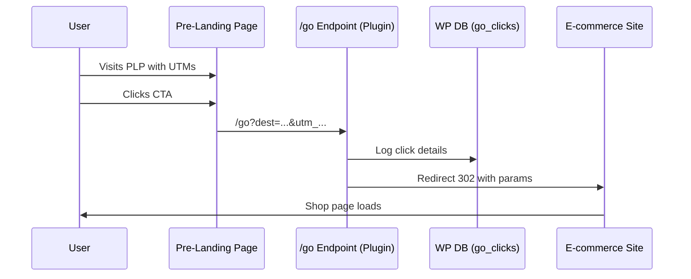
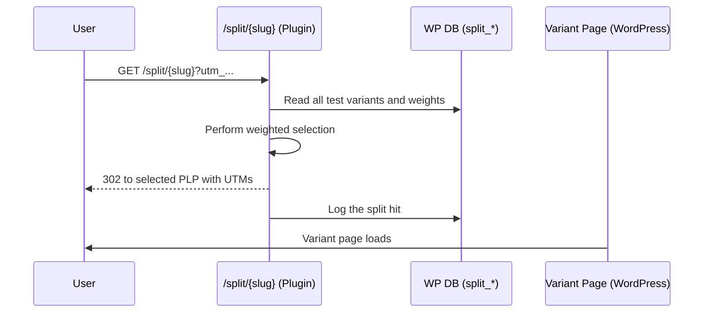

# GoWPTracker – Architecture Overview (v0.6.0)

## 🎯 Goal
The purpose of **GoWPTracker** is to provide two core functionalities for WordPress marketers:
1.  **`/go` Link Tracking**: Server-side tracking of outbound clicks from pre-landing pages (PLPs) to an external e-commerce site.
2.  **`/split` A/B Testing**: A/B testing for WordPress pages with weighted rotation and selection on every visit.

This document outlines the technical architecture of the plugin.

---

## 🏗️ File & Directory Structure
The plugin follows a modular structure to separate concerns and improve maintainability.

- `gowptracker.php`: The main plugin file. Acts as a lightweight loader that initializes the plugin, includes functional modules, and registers all WordPress hooks (actions and filters).

- `includes/`: This directory contains the core logic, broken down by feature.
    - `setup.php`: Handles activation and upgrades. It contains the logic for creating and updating database tables (`dbDelta`).
    - `go/`: Contains all files related to the `/go` link tracking feature.
        - `go-handler.php`: Manages the public-facing `/go` endpoint, including validation, logging, and redirection.
        - `go-admin.php`: Renders the admin reporting page for `/go` clicks, including the data table, chart, and CSV export functionality.
    - `split/`: Contains all files related to the `/split` A/B testing feature.
        - `split-handler.php`: Manages the public-facing `/split/{slug}` endpoint, including weighted variant selection and redirection.
        - `split-admin.php`: A comprehensive module that renders the admin UI for creating, editing, and managing split tests. It also includes the reporting view for test performance.

---

## 🚀 Feature 1: `/go` Link Tracking

### High-Level Architecture
The system introduces a controlled **redirect endpoint** (`/go`) inside WordPress. This endpoint acts as a **gatekeeper**: it logs click metadata before redirecting the user to a whitelisted target URL.

#### Flow
1. **Traffic Entry**: Users arrive on a PLP (e.g., `/migliori-borse`) with UTM parameters from ads.
2. **CTA Click**: Call-to-action buttons point to `/go?dest=https://e-commerce.com/...`.
3. **Redirect Handling**: The `/go` route validates the destination, logs the click, and redirects the user (HTTP 302) to the e-commerce site, preserving all tracking parameters.
4. **Reporting**: The admin panel shows aggregated metrics (clicks per PLP, breakdown by campaign).

### Data Model (`wp_go_clicks`)
| Column       | Type             | Notes                                  |
|--------------|------------------|----------------------------------------|
| id           | BIGINT AUTO_INC  | Primary key                            |
| ts           | DATETIME         | Timestamp of the click                 |
| ip           | VARBINARY(16)    | Visitor IP in binary (for privacy)     |
| ua           | TEXT             | User agent                             |
| referrer     | TEXT             | Page referrer                          |
| dest         | TEXT             | Full destination URL                   |
| ...          | ...              | UTM, GCLID, FBCLID, etc.               |

---

## 🔬 Feature 2: `/split` A/B Testing

### High-Level Overview
The Split Testing feature introduces a public endpoint `^split/{slug}` that routes users to one of multiple WordPress pages (variants) using weighted rotation on every visit.

#### Flow
1. **Request**: A user visits `/split/summer-sale?utm_campaign=promo`.
2. **Variant Selection**: A variant is chosen based on the configured weights for the test. This selection happens on every visit.
3. **Logging & Redirect**: The hit is logged to the database, and the user is redirected (302) to the chosen variant's permalink, with all query parameters propagated.

### Data Model (Split)
The feature uses three dedicated tables:
- `wp_go_split_tests`: Stores the main test configuration (name, slug, status).
- `wp_go_split_variants`: Stores the variants for each test (post_id, weight).
- `wp_go_split_hits`: Logs every redirect, linking a visitor to a specific test and variant.

---

## 🔒 Security Considerations
- **`/go` Endpoint**:
    - **Domain Whitelist**: Strictly prevents open redirects.
    - **Bot/HEAD Blocking**: Filters out most non-human traffic to keep logs clean.
- **`/split` Endpoint**:
    - **No Bot Blocking**: Allows ad and social media crawlers to access landing pages for review.
    - **Redirects**: Only redirects to internal, published WordPress pages via `get_permalink()`, preventing redirection to arbitrary URLs.
- **General**:
    - All user input is sanitized and escaped.
    - Admin-side operations are protected by capability checks (`manage_options`) and nonces.

---

## 🖼️ Sequence Diagrams

### `/go` Flow

### `/split` Flow

